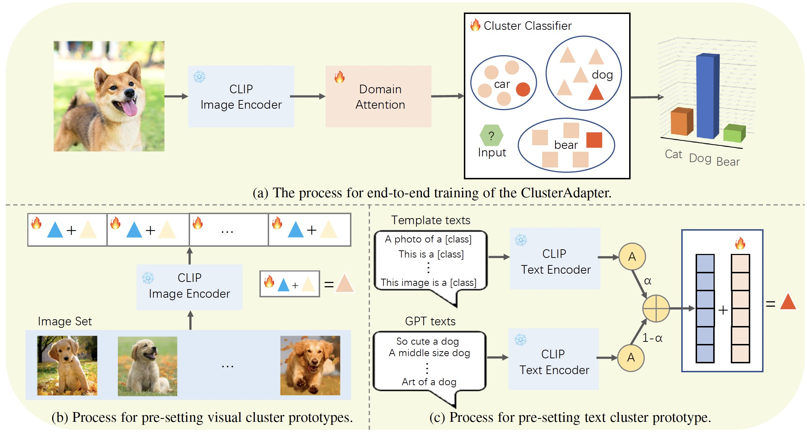

# Cluster-Adapter: Tuning Vision-Language Models with Multiple Prototypes Clustering
Official implementation of Cluster-Adapter: Tuning Vision-Language Models with Multiple Prototypes Clustering.


## Abstract
Benefiting from advances in large-scale pre-training, foundation models, have demonstrated remarkable capability in the fields of natural language processing, computer vision, among others. However, to achieve expert-level performance in specific applications, such models often need to be fine-tuned with domain-specific knowledge. In this paper, we focus on enabling vision-language models to unleash more potential for visual understanding tasks under few-shot tuning. Specifically, we propose a novel adapter, dubbed as ClusterAdapter, which is based on trainable multiple prototypes clustering algorithm, for tuning the CLIP model. It can not only alleviate the concern of catastrophic forgetting of foundation models by introducing anchors to inherit common knowledge, but also improve the utilization efficiency of few annotated samples via bringing in clustering and domain priors, thereby improving the performance of few-shot tuning. We have conducted extensive experiments on 11 common classification benchmarks. The results show our method significantly surpasses original CLIP and achieves state-of-the-art(SOTA) performance under all benchmarks and settings. For example, under the 16-shot setting, our method exhibits a remarkable improvement over the original CLIP by 19.6% and also surpasses TIP-Adapter, GraphAdapter by 2.7% and 2.2% respectively, in terms of average accuracy across the 11 benchmarks. Code will be made publicly available.

<div align="center">
  
</div>

## Requirements
### Installation
Create a conda environment and install dependencies:
```bash
git clone https://github.com/uyzhang/Cluster-Adapter.git
cd Cluster-Adapter

conda create -n cluster_adapter python=3.7
conda activate cluster_adapter

pip install -r requirements.txt

# Install the according versions of torch and torchvision
conda install pytorch torchvision cudatoolkit
```

### Dataset
Follow [DATASET.md](https://github.com/uyzhang/Cluster-Adapter/blob/main/DATASET.md) to install the datasets referring to Tip-Adapter.

## Get Started

### Running
```bash
CUDA_VISIBLE_DEVICES=0 python main.py --config configs/stanford_cars.yaml
```

## Acknowledgement
This repo benefits from [CLIP](https://github.com/openai/CLIP), [CoOp](https://github.com/KaiyangZhou/Dassl.pytorch), [CLIP-Adapter](https://github.com/gaopengcuhk/CLIP-Adapter) and [Tip-Adapter](https://github.com/gaopengcuhk/Tip-Adapter).. Thanks for their wonderful works.

## Citation
```bash
```